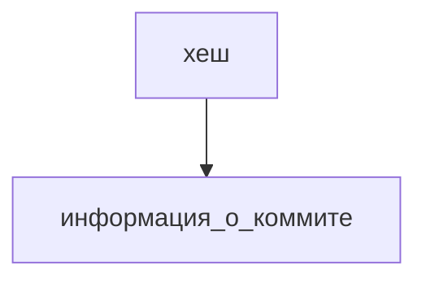

# Шпаргалка Git

## Команды

`pwd` – вывести текущую директорию

`cd имя_папки` – сменить директорию

- `cd ~` – перейти в домашнюю директорию пользователя
- `cd ..` – на уровень выше (родительская директория)
- `cd .` – текущая диретория (используется редко)

`ls` – вывести содержимое директории

- `ls -a` – вывести расширенный список файлов (скрытые; начинающиеся с `.` (точки))
- `ls ~` – содержимое домашней директории
- `ls ..` – содержимое родительской директории

### Создание файлов и директорий – `touch`, `mkdir`

`touch имя_файла` – создать файл

`mkdir имя_папки` – создать директорию

- `mkdir -p dir1/dir-inside/dir-deeper-inside` – создать с вложенными директориями

### Копирование файлов – `cp`

`cp что_копируем куда_копируем` – копирование файла

`cp что_копируем1 что_копируем2 что_копируем3 куда_копируем` – копирование нескольких файлов

### Чтение файлов – `cat`

cat (от англ. concatenate and print — «объединить и распечатать»)

`cat имя_файла`

Работает только с текстовыми файлами

### Удаление файлов и папок – `rm`, `rmdir`, `rm -r`

`rm имя_файла` – удалить файл

`rmdir имя_папки` – удалить папку, если она пустая, иначе, выведет сообщение, что папка не пуста: `Directory not empty`

`rm -r имя_папки` – удалить папку со всем содержимым рекурсивно.

Ключ `-r` — от англ. ***r****ecursive*, «рекурсивный». Это значит, что удаление будет последовательно применяться к каждому из элементов в этой папке — пока не сотрёт их все. Затем команда удалит пустую директорию.  

`rm -rf имя_папки` – удалить рекурсивно и принудительно, без вопросов на удаление файлов

Ключ `-f` – (от англ. ***f****orce* — «заставить») избавит вас от вопросов вроде «Вы точно хотите удалить этот файл? А этот? И этот тоже?».

### Выполнение нескольких команд – `&&`

`mkdir second-project && cd second-project && touch index.html style.css`

создаём папку `second-project`, переходим в папку `second-project` и создаём в ней два файла: `index.html` и `style.css`

## Настройка

### `.gitconfig`

`git config --global user.name “имя/никнейм“` – задает имя/никнейм

`git config --global user.email username@.mail.ru` – задает электронную почту

`git config --list` – вывести настройки

## Репозиторий

`git init` – инициализация репозитория

### Проверить состояние репозитория — `git status`

`git status` – показывает текущее состояние репозитория.

### Подготовить файлы к сохранению — `git add`

`git add имя_файла` – подготовить файл к сохранению

`git add --all` – все файлы в репозитории

`git add .` – текущая папка

### Выполнить коммит — `git commit`

`git commit -m "Сообщение коммита"`

Коммит нужно описывать так, чтобы было понятно, какие именно изменения были сделаны. Например:

* Добавлено важное дело в TODO
* Добавлена сортировка имён
* Исправлена ошибка в цикле

### Просмотреть историю коммитов — `git log`

---

## Хеш — идентификатор коммита

Хеширование — это способ преобразовать набор данных и получить их «отпечаток».

Информация о коммите:
* когда быд сделан коммит
* содержимое файлов в репозитории на момент коммита
* ссылка на предыдущий или родительский коммит

Git хранит таблицу соответствий `хеш → информация о коммите`. Если вы знаете хеш, вы можете узнать всё остальное: автора и дату коммита и содержимое закоммиченных файлов.

Хеши и таблицу `хеш → информация о коммите` Git сохраняет в служебных файлах в папке .git.
